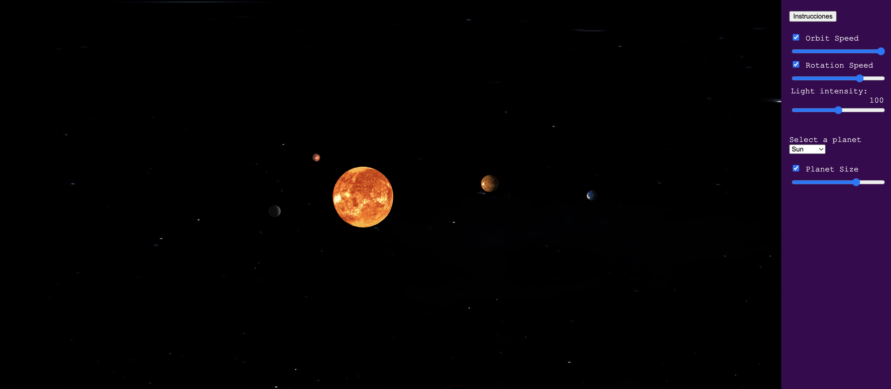

# Trabajo final de Fundamentos de la computación gráfica

Para poder probarlo sin inconvenientes ir la [versión web del proyecto](https://lilmonk3y.github.io/fcg_tps/).
Escribimos un informe describiendo el trabajo en [esta carpeta](https://drive.google.com/drive/folders/1oBP_JgJKc2-NmDMml-Kf_GmF9grZnYd3?usp=sharing).

En este trabajo recreamos un sistema solar. Para navegar por la escena tenemos una cámara que se puede desplazar en cualquier dirección.

Contamos con algunos parámetros configurables como __la velocidad de orbitado__ de los planetas alrededor del sol, __la intensidad de la luz del Sol__, la __velocidad de rotación__ sobre su propio eje y también el __diametro de los planetas__.

## Comandos de desplazamiento

Para desplazar la cámara usamos las teclas __W, A, S y D__.

W: Avanzar

S: Retroceder.

A: Desplazamiento a la izquierda.

D: Desplazamiento a la derecha.

Para mover el angulo de la cámara usamos el mouse. __Cliqueamos y desplazamos en alguna dirección__.

Para fijar la cámara en alguno de los planetas usamos los __números del 0-8 donde el 0 es el Sol y el 8 es Neptuno__.

## Errores conocidos
Puede suceder que no se carguen todos los planetas la primera vez accedas a la página pero encontramos que se soluciona refrescando la misma. 

# Correr en local

1. Descargar visual studio code.
2. Descargar e instalar el pluguin "live server".
3. En View>Command Palette escribir ">live server: Open with Live Server" y luego dar enter.
4. Se debería abrir el proyecto en una pestaña del browser.

## Explicación
Por la politica de Cross origin resourse sharing el browser (la aplicación corriendo en el browser) no puede acceder a archivos del usuario. Por este motivo es que al usar este pluggin y levantar un server local se puede acceder a los archivos ya que el código fuente y los archivos se guardan en el server y cuando el browser corre la app los request se hacen del browser al web server y no hay inconvenientes.

Una forma de que esto no pase luego de terminado el trabajo es subiendo la aplicación a la nube.