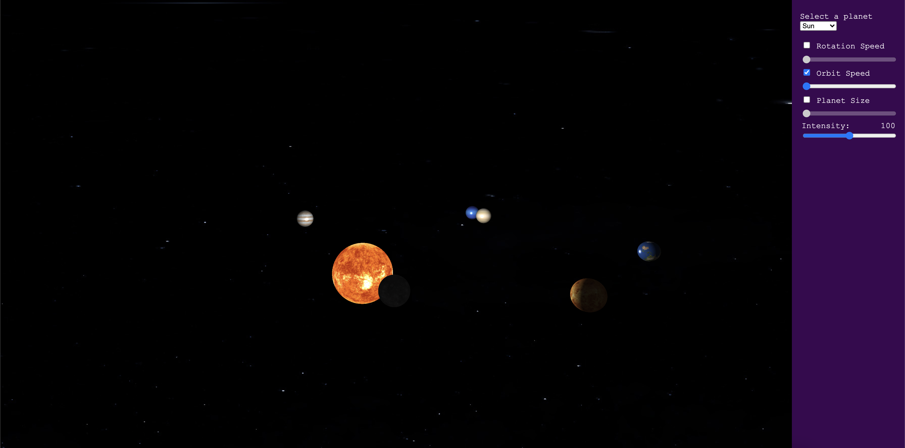

# Trabajo final de Fundamentos de la computación gráfica

Para poder probarlo sin inconvenientes ir la [versión web del proyecto](https://lilmonk3y.github.io/fcg_tps/).

## Errores conocidos
Puede suceder que no se carguen todos los planetas la primera vez accedas a la página pero encontramos que se soluciona refrescando la misma. 

# Correr en local

1. Descargar visual studio code.
2. Descargar e instalar el pluguin "live server".
3. En View>Command Palette escribir ">live server: Open with Live Server" y luego dar enter.
4. Se debería abrir el proyecto en una pestaña del browser.

## Explicación
Por la politica de Cross origin resourse sharing el browser (la aplicación corriendo en el browser) no puede acceder a archivos del usuario. Por este motivo es que al usar este pluggin y levantar un server local se puede acceder a los archivos ya que el código fuente y los archivos se guardan en el server y cuando el browser corre la app los request se hacen del browser al web server y no hay inconvenientes.

Una forma de que esto no pase luego de terminado el trabajo es subiendo la aplicación a la nube.